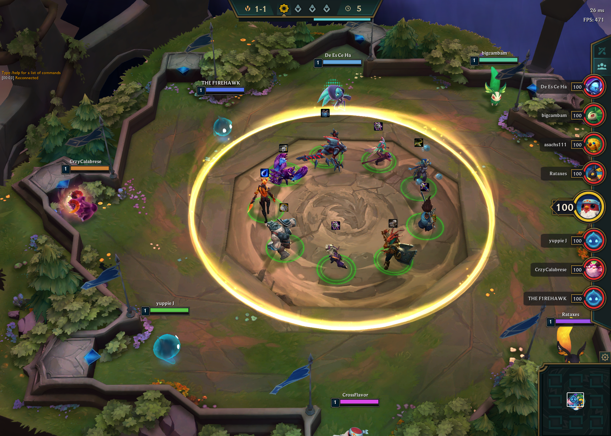
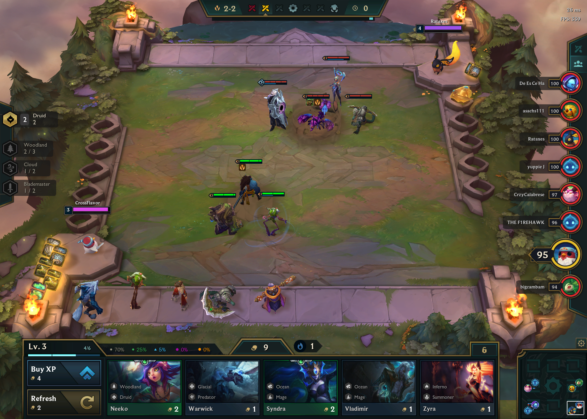
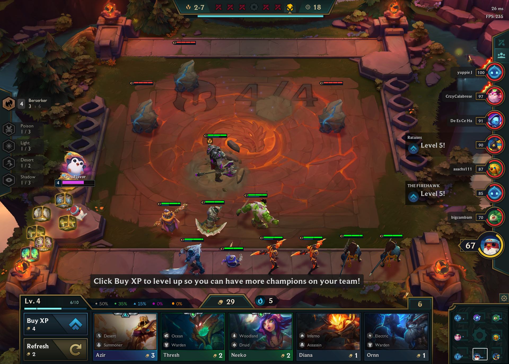

# Capstone Project : Unraveling the Team Composition Influence in TFT 

### Table of Contents:
- [Problem Statement](#Problem-Statement)
- [Game Description](#Game-Description)
    - [Game Phases](#Game-Phases)
    - [Champions & Set Effects](#champions--set-effects)
- [Executive Summary](#Executive-Summary)
    - [Data Gathering](#Data-Gathering)
    - [Data Cleaning & Pre-Processing](#data-cleaning--pre-processing)
    - [Initial Discovery (EDA)](#initial-discovery-eda)
    - [Modeling](#Modeling)
    - [Model Evaluation](#Model-Evaluation)
 - [Conclusion](#Conclusion)
 - [Recommendation](#Recommendation)
 - [Limitations](#Limitations)

- [Data Dictionary](#Data-Dictionary)

## Problem Statement

With the massive growth of e-sports and competitive online games, developers strive to come up with a revolutionary new genre that may shape the future of e-sports.  In 2019, a new type of 8 player free for all online game, aka “auto-chess” has been on the rise and Riot Games has created a version of their own by the name of Team Fight Tactics with expectations of mobile releases in 2020.

Certain final team compositions and item builds may affect the outcome of a random match in a TFT.  Depending on what strategy an individual takes, a player can gain an advantage over other players slightly.  Using supervised classification models we will see if we can accurately predict the placement of a player ranging from 1st place to 8th place with higher accuracy than our baseline score of 14.56% to determine if there are indeed significant team composition or champion units that may affect the outcome of a player.

## Game Description

Teamfight Tactics is an alternative turn-based mode in a Multiplayer Online Battle Arena (MOBA) game, League of Legends by Riot Games.  Teamfight Tactics was created with the game foundation inspired by Dota Auto Chess (another alternative mode from a MOBA game) infused with champions from League of Legends.  A player is given a chance during his planning phase to purchase and/or place champions on a board with 8 rows and 7 columns of hexagons split horizontally for 2 players. 

### Game Phases

Teamfight Tactics has 4 general phases that cycle.
1. **Carousel Phase:** At the start of a match, begins a carousel phase where 8 players (if later in the game, players remaining) simultaneously compete to choose the first champion from a rotating carousel of champions in the center of the board.  After the first carousel phase, all other carousel phases will have two players simultaneously choose champions at a time starting with the two weakest players. Then begins the planning phase.  

	
2. **Planning Phase:** Planning phase occurs between every other phase and players are rewarded gold coins which can be spent on purchasing level experience or champion units.  During this phase, every player is simultaneously given an access to the shop which shows a random pool of 5 champions to purchase from a global pool of champions shared by all players.  Note that tier level of the champion (higher tier means stronger base stats) available in the shop are based on player levels. (experience needed for the player to level up increases per level increased) After a player purchases a unit, it is stored in the player's inventory so the player can choose to place the unit on the board.  When the player does not enough units on the board equivalent to the player's level, player's units are automatically placed on the board starting with the first unit in the player's inventory.

3. **Player vs. Environment (PVE) Phase:** PVE phase is where the player's units automatically fight the neutral units on the board without the player having control of the units placed on their side of the board.  When the player kills the neutral unit, there is a random chance for the player to obtain a random number of items or gold coins based on the number of neutral units on the board killed. Once again, planning phase will occur and players can make changes to their board udirng this phase to prepare for the PVP phase.

4. **Player vs. player (PVP) phase** PVP phase is a clash between two random players.  All players start out the match with 100 health points where every neutral or enemy player's unit that survives fighting the player's team does damage until the player reaches 0 points.  A player's health point is a universal scoring system that will carry over throughout all phases and a ranking of the players is determined based on the health point remaining throughout the match.  After some combination of PVP and PVE phases, the carousel phase returns and the cycle repeats until only a single player is alive.  

### Champions & Set Effects

In Teamfight Tactics, all champions start as tier 1 but are automatically fused into tier 2 and 3 when the player obtains 3 copies of the identical units of the same tier.  Higher tier of units equate to higher base stats of the unit.  All units have 1 or 2 traits that are assigned to the units (static) which can give the entire team or the units with the same traits additional bonus effects that can benefit the team.  The bonus effect of the traits only activate when the specific units are placed on the board which is the reason for team compositions being so influential over a player's outcome of the match.  

## Executive Summary

### Data Gathering

In order to perform any modeling or analysis, first thing we need to do is to obtain the appropriate data, then clean the data so that information can be interpreted through modeling techniques offered by the python library.  Since our analysis is based on the game data for TFT, we decided to use the RIOT API offered by the game developer.  RIOT API allows us to gather our data directly from the game serer although it is still in development as of March 2020. In order to obtain the appropriate data for our analysis, we needed to first query all the player's IDs from different ranking divisions.  Then we used the player's IDs to query for all match IDs corresponding to each of the player's IDs.  Using the match IDs, we then queried to obtain all the match information to store in a dataframe.  At last, we extracted specifically the team composition & champion unit data along with player's final placement positions and stored it as a csv file in order to prevent the need to re-query for data. 

### Data Cleaning & Pre-Processing

Since we are interested in using team combinations and champion units information as features, we needed to first extract these columns as well as the column with our target variables, placememt.  We created two separate dataframes combo_filtered_game_df and champion_filtered_game_df which contains just the dummy columns of the features 'trait' and 'units'.  The 'trait' feature included the different team combo bonus that a player achieved.  Trait columns have the format 'Warden_1' where warden is the name of the combo achieved and 1 is the tier number for the combo achieved (tier 1 is achieved when player places two or three champions with the same combo type on the board while tier 2 is achieved when player places four or six champions with the same combo type).  The 'unit' feature included the different champions that a player had on their board when they were eliminated from the game (or if you are the winnner, the units that were placed on the board for the final battle).  Once we created our two separate dataframes, we checked the columns to exclude any features that had null values and dropped the columns as well (some unachievable combos or unobtainable units were included in the data).

### Initial Discovery (EDA)

Once our data was pre-processed, we were able to plot the top team combinations and top champion units used by the players of each final placement to visually inspect if there were any noticeable combos or champion units used particularly more by players who placed 1st or 2nd versus players who placed lower.  

From looking at top team combinations found used by each of the placements, it was a surprise to find that there was a "popular" trend of team combos that everyone from winners to losers were all following.  In the real world of e-sports, this is what the community calls "meta" which is what players believe to be the best at the current patch of the game.  Everyone from 1st place to 8th place all had Warden, Glacial, and Ranger as their most often used team compositions and the only major noticeable difference was that Poison compositions were used more often by 1st place players versus lower placement players.

From looking at top champion units found used by each of the placements, we were also able to find a similar trend exists for champion units used as well.  Kindred was a champion that was basically sought out by players of all placement.  However, what seems to be slightly more interesting is that Malphite and Sion were the champions second and third most used by 1st place winners but frequency of Malphite and Sion being used by lower placements slowly went down the chart as the placements dropped.  There were some noticeable Poison team composition units such as Twitch, Alchemist (Singed), and Dr.Mundo who were apparent for 1st place player that weren't as apparent in the lower placements.

### Base Line

If our data was evenly distributed for all placements, we would take our baseline model score as 1/ $k$ where $k$ is defined as the number of classes.  However, we notice that the distribution is actually not even so we will take the percentage of our most apparent class and use that as our baseline score : 14.56% 

### Modeling 

Going back to the problem statement, we want to verify using classification models (our target being a class of 'placement' ranging from 1st to 8th in integer value) if we can predict a player's placement more accurately than our baseline model.  Since this is a multiclass classification model, we decided to work with familiar models that can handle such a case.  The first model selections were Decision Trees , Bagged Decision Trees, and Random Forest Trees.  One of the main reasons trees were chosen as our primary method of approach was due to decision trees ignoring collinearity of features by greedily choosing the optimal decision even though it can often lead to overfitting.  We considered bagging in attempt to "smooth out" the predictions obtained using complex base models whereas we also considered boosting strategies to approach the problem using large number of "weak learners" the model's instance can learn from in order to have a stronger learner.  In this project, we also utilized XGBoost which is an implementation of gradient boosting which has recently grown popular due to it's execution speed and model performance.  Considering our limitations, XGBoost seemed like an ideal candidate to obtain comparable results. Another method we used to reduce overfitting issues from our decision trees, was that we used k-fold cross-validation method in our gridsearch while tuning for hyperparameters to smooth out our results by averaging multiple optimal models.  As a result, we were able to slightly increase our accuracy score while tackling the massive overfit issue.

### Model Evaluation

When comparing our accuracy scores from our models using team combo features versus champion units features, there is a definitive indication that our models perform with higher accuracy scores when using the champion units dataset.  This was apparent across all the models we tested for so we made a decision to work on tuning our models using the champion units data in particular.  Across all our results, the accuracy scores were approximately 20~27% which actually outperformed our baseline model by over 10%.  Although 25% does not seem like a great accuracy score at first, when comparing to our baseline model with ~15% accuracy, we have outperformed our baseline model by an additional ~70%.  Our decision tree, bagged decision tree, and random forest trees as expected were severely overfit with train scores above 95%.  After optimizations using hyperparameter tuning, our models were less overfit to the train data but still did not produce better test results than our AdaBoost and XGBoost results.  Our AdaBoost and XGBoost train scores were however not as overfit and at the sametime had the highest accuracy scores of 26.76% and 25.32% respectively. 

## Conclusion

In the end, we were able to predict a player's placement in a match of TFT with 26.76% accuracy.  By extracting the important features according to our AdaBoost model, it was also evident that Zed (tier 2) and Brand (tier 2) had the most importance in determining a player's outcome of a match.  In the beginning, this project was set out to look for a way to predict an outcome of an 8 player free for all game through understanding the "popular winning strategy".  However, we can infer a slightly different meaning towards such a question.  Zed and Brand are both champion units that are available for players who make it to the later parts of the stage (you need to be higher level to have a chance at obtaining these units which means you cannot be knocked out early).  As a result, it would be impossible for someone with low placement score to have these units.  In the end, "popular" winning strategies had no other significance because the information was shared across all players and every player sought to reach for these units.  It was actually the units that are not "played often" but when they do, they can be good indications rather than potentially the popular "Good" champion units.  

### Limitations 

Although high collinearity was foreseeable in our features, we still believed that our model's predicting power could overcome the issue and have a higher accuracy score for predicting the placement of a player than our baseline model.  We were limited in our model selection eliminating the simple likes of knn classifications and more sophisticated one vs all classifications all due to the overlapping collinearity amongst our features.  We could potentially reduce the overfit issue by increasing the sample size and using additional feature selection; however, RIOT API is still early in the development stage for TFT data and this is something that can be implemented once additional data is released.  Other than what is an issue based on our data, there are also theoretical limitations as to trying to predict an outcome based on purely the resulting game information rather than what moves a player can make between the individual phases.  

## Recommendation

As any other online games, Teamfight Tactics is a new game based on a new evolving "genre", and Riot's stance on "wary of bot creation through machine learning" should not be taken lightly. However, until a more comprehensive version of RIOT API is fully polished for public uses, this project would be a good basis to begin further analysis Teamfight Tactics for any user that wants to begin diving into Teamfight Tactics data analysis.  As for actual prediction on "winning strategy", it is difficult to summarize from our findings a specific team composition has any more benefit over another team composition with a slight emphasis on using Poison team composition that may yield slightly higher chance of obtaining 1st place. 

## Data Dictionary

### Main Data features

|Feature|Type|Dataset|Description|
|---|---|---|---|
|gold_left|float|game_df|Total number of gold coins a player had remaining when eliminated from the game| 
|last_round|float|game_df|Round number a player was on when eliminated from the game| 
|level|float|game_df|The player's level when eliminated from the game| 
|placement|float|game_df|Player's final placement (1st - 8th)|
|players_eliminated|float|game_df|Total number of match opponents a player eliminated throughout the course of the game before finally being eliminated from the game|
|time_eliminated|float|game_df|Total number of time elapsed (in seconds)|
|total_damage_to_players|float|game_df|Total number of damage inflicted to match opponents.|
|summonerName|object|game_df|Player's game ID|
|division_tier|object|game_df|Player's division name and tier.|

Additional data information on scrape data can be found here : 
https://developer.riotgames.com/docs/tft#static-data_previous-sets

Additional data information on specific team compositions and champion units can be found here : 
https://progameguides.com/teamfight-tactics/tft-rise-of-the-elements-champions-classes/

 ## Sources
 
 Multiclass Classification Overfit Reduction related : 
 https://towardsdatascience.com/dealing-with-multiclass-data-78a1a27c5dcc
 http://proceedings.mlr.press/v97/feldman19a/feldman19a.pdf
 https://hackernoon.com/boosting-algorithms-adaboost-gradient-boosting-and-xgboost-f74991cad38c
 
 RIOT API related : https://developer.riotgames.com/
 In-game Info Data Dictionary : https://progameguides.com/teamfight-tactics/tft-rise-of-the-elements-champions-classes/
 XGBoost related : https://xgboost.readthedocs.io/en/latest/
 Ensemble Method related : https://www.davidhbailey.com/dhbpapers/Ensemble-CIKM.pdf
